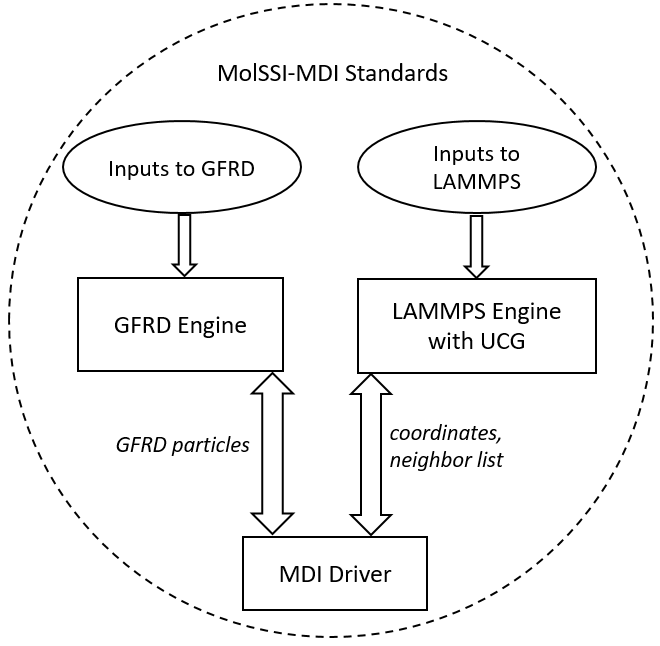

# **Main page of the UCG-GFRD technique**

The major purpose of this tool is to perform simulations of reactive-diffusive systems in a computationally efficient manner. Typically, the  bottleneck in simulating such systems arises from the huge computational time spent on randomly diffusing the components prior to their respective reactions. This tool addresses it by combining two different multiscale techniques: ***Ultra-Coarse-Graining (UCG) and Green's Function Reaction Dynamics (GFRD)***

## **Ultra-Coarse-Graining (UCG):** 
System components in this approach are represented using explicit particles. Briefly, the method involves: (i) dividing the phase-space of the system into discrete states; the states can represent chemical changes like reactants/products and/or conformational changes like folded/unfolded states and (ii) constructing coarse-grained (CG) model and developing effective CG potential for each state. The system discretely transitions to different states and between each transition, it evolves continuously in time using the CG potential of the current state in a regular MD technique. These transitions mimic the reactions of interest and the rules governing the transitions include the conformational energetic differences between the states thereby relating the fluctuations to reactions.

## **Green's Function Reaction Dynamics (GFRD):** 
It is a mesoscale level technique. The Green's function of Einstein's diffusion equation is solved to propagate the randomly diffusing particles in time. This approach involves encompassing those particles in spherical domains and creating an ordered event list consisting of their domain exit time calculated from the Green's function.

For complete story, refer to the following journal articles:
1) The Theory of Ultra-Coarse-Graining. 1. General Principles

2) The Theory of Ultra-Coarse-Graining. 2. Numerical Implementation

3) Green's Function Reaction Dynamics: A Particle-Based Approach for Simulating Biochemical Networks in Time and Space

4) Combining Molecular Dynamics with Mesoscopic Green's Function Reaction Dynamics Simulations

## **How to use**

The UCG-GFRD package works with LAMMPS. UCG is implemented as a LAMMPS ***fix***. GFRD is implemented as a standalone tool. The MolSSI-MDI driver interconnects UCG and the GFRD package

- Clone the latest MDI-enabled version of [LAMMPS](https://github.com/srmani/MDI-lammps.git)
- Build LAMMPS following the [procedure](https://lammps.sandia.gov/doc/Build.html). Key steps are
  - make lib-mdi args="-m mpi"
  - make yes-user-mdi
  - make mpi
- Clone the [GFRD](https://github.com/srmani/GFRD) package
- Clone the [UCG-GFRD-Driver](https://github.com/srmani/UCG-GFRD-Driver)

## **Basic UCG-GFRD package architecture**

The UCG-GFRD package is implemented using [MolSSI-MDI](https://www.sciencedirect.com/science/article/pii/S0010465520303386) standards. The MDI based driver acts as a interface between the LAMMPS and the GFRD engine. It ensures seamless passing and integration of required data across the engines at required simulation timesteps.

## **Commands supported by the GFRD Engine**

The following commands will be supported by the GFRD engine in @DEFAULT MDI node (:Yes, :No). Refer to the [MDI Standards](https://molssi-mdi.github.io/MDI_Library/html/mdi_standard.html) for a complete list of commands that can be incorporated with an engine.

|     | @DEFAULT |
| --- |   ---    |
| <CELL | |
| >CELL | |
| <COORDS | |
| >COORDS | |
| <MASSES | |
| <NATOMS | |

**Important features of the package are**
1. Each engine is separate and is not dependent on the other engine
2. Each engine-driver pair can be executed separately without the other engine
  - LAMMPS-engine: simulate the entire system with explicit particles
  - GFRD-engine: simulate the entire system using only GFRD domains