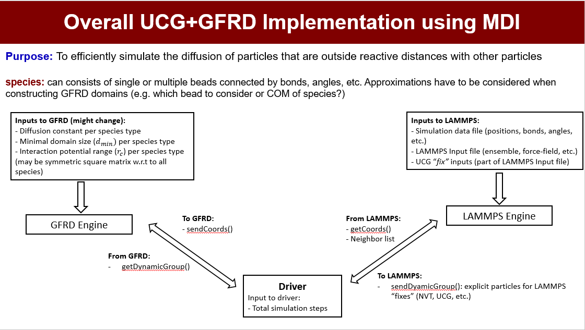

MolSSI-MDI based driver combining Ultra-Coarse-Graining (UCG)and Green's Function Reaction Dynamics

Refer to the following journal articles to understand the UCG and GFRD technique:
1) The Theory of Ultra-Coarse-Graining. 1. General Principles

2) The Theory of Ultra-Coarse-Graining. 2. Numerical Implementation

3) Green's Function Reaction Dynamics: A Particle-Based Approach for Simulating Biochemical Networks in Time and Space

4) Combining Molecular Dynamics with Mesoscopic Green's Function Reaction Dynamics Simulations

