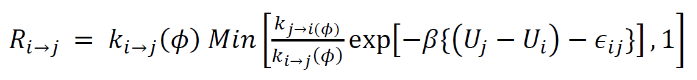

# **Ultra-Coarse-Graining**

The method involves defining discrete states for each component in the simulation system and then constructing the model and force-field for each of the states. The model and the force-field can be at the all-atom or the coarse-grained (CG) level.

For example, if the reaction A <-> B is simulated at a coarse-grained level, then the UCG states are (i) reactant A and  (ii) product B. As mentioned above, for performing UCG simulations, one has to have a separate CG model for state A and state B and also, their respective force-fields.

The UCG functionality is agnostic of the way in which the force-field for each of the states is derived. In the case of CG force-fields, one can use any of the known methods (Force Matching or Relative Entropy Minimization or Inverse Boltzmann) to construct the force-field for each state. Since, the UCG functionality is implemented as a **LAMMPS** ***fix***, the only requirement is that the developed force-field has to be given as input in a format suitable for ***LAMMPS***.

In the UCG method, reactions as above (A <-> B) are simulated as state transitions. The rate of state transition is controlled by the equation:

In the above equation, the prefactors k_ij and e_ij are treated as parameters and are given as inputs for each simulated reaction.

## Syntax of **UCG** ***fix***

The syntax of UCG fix is very similar to any other _fix_ of LAMMPS (fix ID group_ID ucg_gfrd **UCG inputs**). The specific inputs to UCG fix are:
1) Beta : product of boltzmann constant and temperature of interest simulation 
2) npecies : the number of distinct components in the system
3) nstates : the number of states for each component in the system. 
4) speciesbeads : the number of atoms/beads used to represent each component in the system
5) aoffset : the atom type offset for each component in the system
6) boffset : the bond type offset for each component in the system
7) rates : name of the file containing the k_ij vales for each reaction simulated
8) mhcorr : name of the file containing the e_ij values for each reaction simulated
9) restrictmol : name of the file containing molecule IDs that are to be neglected for reaction

For a single component system undergoing a reaction A <-> B, the syntax is

fix UCG all ucg_gfrd 2222 Beta 1.6775 nspecies 1 nstates 2 speciesbeads 1 aoffset 1 boffset 0 rates rates.in mhcorr mhcorr.in restrictmol restrictmol.in

For a two component system where each component undergoes a reaction A <-> B and C <-> D,

fix UCG all ucg_gfrd 2222 Beta 1.62345 nspecies 2 nstates 2 2 speciesbeads 2 1 aoffset 2 1 boffset 1 0 rates rates.in mhcorr mhcorr.in restrictmol restrictmol.in
